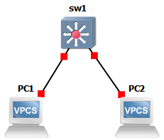
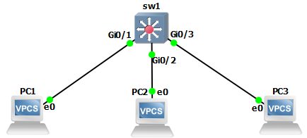
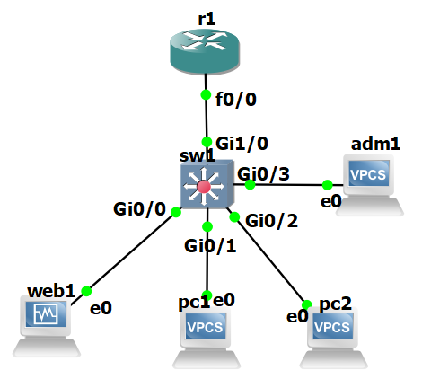
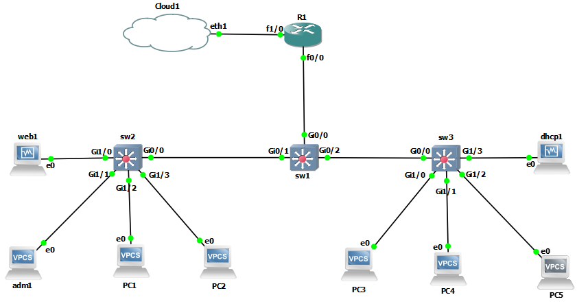

# TP4 : Vers un réseau d'entreprise

On va utiliser GNS3 dans ce TP pour se rapprocher d'un cas réel. On va focus sur l'aspect routing/switching, avec du matériel Cisco. On va aussi mettre en place des VLANs.

# Sommaire

- [TP4 : Vers un réseau d'entreprise](#tp4--vers-un-réseau-dentreprise)
- [Sommaire](#sommaire)
- [I. Dumb switch](#i-dumb-switch)
  - [1. Topologie 1](#1-topologie-1)
  - [2. Adressage topologie 1](#2-adressage-topologie-1)
  - [3. Setup topologie 1](#3-setup-topologie-1)
- [II. VLAN](#ii-vlan)
  - [1. Topologie 2](#1-topologie-2)
  - [2. Adressage topologie 2](#2-adressage-topologie-2)
    - [3. Setup topologie 2](#3-setup-topologie-2)
- [III. Routing](#iii-routing)
  - [1. Topologie 3](#1-topologie-3)
  - [2. Adressage topologie 3](#2-adressage-topologie-3)
  - [3. Setup topologie 3](#3-setup-topologie-3)
- [IV. NAT](#iv-nat)
  - [1. Topologie 4](#1-topologie-4)
  - [2. Adressage topologie 4](#2-adressage-topologie-4)
  - [3. Setup topologie 4](#3-setup-topologie-4)
- [V. Add a building](#v-add-a-building)
  - [1. Topologie 5](#1-topologie-5)
  - [2. Adressage topologie 4](#2-adressage-topologie-5)
  - [3. Setup topologie 5](#3-setup-topologie-5)

# **0. Prérequis**

## **Checklist VM Linux**

A chaque machine déployée, vous **DEVREZ** vérifier la 📝**checklist**📝 :

- [x] IP locale, statique ou dynamique
- [x] hostname défini
- [x] firewall actif, qui ne laisse passer que le strict nécessaire
- [x] on force une host-only, juste pour pouvoir SSH
- [x] SSH fonctionnel
- [x] résolution de nom
  - vers internet, quand vous aurez le routeur en place

# **I. Dumb switch**

## **1. Topologie 1**



## **2. Adressage topologie 1**

| Node  | IP            |
|-------|---------------|
| `pc1` | `10.1.1.1/24` |
| `pc2` | `10.1.1.2/24` |

## **3. Setup topologie 1**

#### **🌞 Commençons simple**
- **Définissez les IPs statiques sur les deux VPCS**
    ```
    # On définit les addresses IP
    
    PC1> ip 10.1.1.1/24
    Checking for duplicate address...
    PC1 : 10.1.1.1 255.255.255.0
    
    PC2> ip 10.1.1.2/24
    Checking for duplicate address...
    PC2 : 10.1.1.2 255.255.255.0
    ----------------------------------
    # Vérifications
    
    PC1> show ip

    NAME        : PC1[1]
    IP/MASK     : 10.1.1.1/24
    GATEWAY     : 0.0.0.0
    DNS         :
    MAC         : 00:50:79:66:68:00
    LPORT       : 20006
    RHOST:PORT  : 127.0.0.1:20007
    MTU         : 1500
    ```
- **`ping` un VPCS depuis l'autre**
    ```
    PC1> ping 10.1.1.2 -c 2

    84 bytes from 10.1.1.2 icmp_seq=1 ttl=64 time=5.545 ms
    84 bytes from 10.1.1.2 icmp_seq=2 ttl=64 time=8.601 ms
    -------------------------------------------------------
    PC2> ping 10.1.1.1 -c 2

    84 bytes from 10.1.1.1 icmp_seq=1 ttl=64 time=11.604 ms
    84 bytes from 10.1.1.1 icmp_seq=2 ttl=64 time=10.701 ms
    ```

> Jusque là, ça devrait aller. Noter qu'on a fait aucune conf sur le switch. Tant qu'on ne fait rien, c'est une bête multiprise.

# II. VLAN

**Le but dans cette partie va être de tester un peu les VLANs.**
On va rajouter un **troisième client** qui, bien que dans le même réseau, **sera isolé des autres grâce aux VLANs**.
**Les VLANs sont une configuration à effectuer sur les switches.** C'est les switches qui effectuent le blocage.
Le principe est simple :

- **Déclaration du VLAN sur tous les switches**
    - Un VLAN a forcément un ID (un entier)
    - Bonne pratique, on lui met un nom
- **Sur chaque switch, on définit le VLAN associé à chaque port**
    - Genre "sur le port 35, c'est un client du VLAN 20 qui est branché"

## 1. Topologie 2



## 2. Adressage topologie 2

| Node  | IP            | VLAN |
|-------|---------------|------|
| `pc1` | `10.1.1.1/24` | 10   |
| `pc2` | `10.1.1.2/24` | 10   |
| `pc3` | `10.1.1.3/24` | 20   |

### 3. Setup topologie 2

#### **🌞 Adressage**

- **Définissez les IPs statiques sur tous les VPCS**
    ```
    # On définit les addresses IP
    PC1> ip 10.1.1.1/24
    Checking for duplicate address...
    PC1 : 10.1.1.1 255.255.255.0
    ---------------------------------
    PC2> ip 10.1.1.2/24
    Checking for duplicate address...
    PC2 : 10.1.1.2 255.255.255.0
    ---------------------------------    
    PC3> ip 10.1.1.3/24
    Checking for duplicate address...
    PC2 : 10.1.1.3 255.255.255.0
    ```
- **Vérifiez avec des `ping` que tout le monde se ping**
    ```
    PC1> ping 10.1.1.2 -c 3

    84 bytes from 10.1.1.2 icmp_seq=1 ttl=64 time=7.543 ms
    84 bytes from 10.1.1.2 icmp_seq=2 ttl=64 time=7.532 ms
    84 bytes from 10.1.1.2 icmp_seq=3 ttl=64 time=6.045 ms
    --------------------------------------------------------
    PC2> ping 10.1.1.3 -c 3

    84 bytes from 10.1.1.3 icmp_seq=1 ttl=64 time=8.053 ms
    84 bytes from 10.1.1.3 icmp_seq=2 ttl=64 time=5.151 ms
    84 bytes from 10.1.1.3 icmp_seq=3 ttl=64 time=6.817 ms
    --------------------------------------------------------
    PC3> ping 10.1.1.1 -c 3

    84 bytes from 10.1.1.1 icmp_seq=1 ttl=64 time=7.373 ms
    84 bytes from 10.1.1.1 icmp_seq=2 ttl=64 time=6.256 ms
    84 bytes from 10.1.1.1 icmp_seq=3 ttl=64 time=20.608 ms
    ```

#### **🌞 Configuration des VLANs**

- **Référez-vous à la section VLAN du mémo Cisco**
- **Déclaration des VLANs sur le switch `sw1`**
    ```
    # Passage en mode priviligié puis mode config
    Switch>enable 
    Switch#conf t
    ---------------------------------------------
    # Création des 2 vlan + leurs nom
    Switch(config)#vlan 10  
    Switch(config-vlan)#name authorised
    Switch(config-vlan)#exit
    ----------------------------------
    Switch(config)#vlan 20
    Switch(config-vlan)#name restricted  
    Switch(config-vlan)#exit
    ---------------------------------------------
    # Vérifications
    Switch(config)#do show vlan br
    
    VLAN Name                             Status    Ports
    ---- -------------------------------- --------- -------------------------------
    [...]
    10   authorised                           active    
    20   restricted                           active    
    [...]
    ```
- **Ajout des ports du switches dans le bon VLAN (voir [le tableau d'adressage de la topo 2 juste au dessus](#2-adressage-topologie-2))**
    - **Ici, tous les ports sont en mode *access* : ils pointent vers des clients du réseau**
    ```
    # PC1 dans vlan10
    Switch(config)#interface GigabitEthernet0/1
    Switch(config-if)#switchport mode access
    Switch(config-if)#switchport access vlan 10
    Switch(config-if)#exit
    --------------------------------------------
    # PC2 dans vlan10
    Switch(config)#interface GigabitEthernet0/2
    Switch(config-if)#switchport mode access
    Switch(config-if)#switchport access vlan 10
    Switch(config-if)#exit
    --------------------------------------------
    # PC3 dans vlan20
    Switch(config)#interface GigabitEthernet0/3
    Switch(config-if)#switchport mode access
    Switch(config-if)#switchport access vlan 20
    Switch(config-if)#exit
    --------------------------------------------
    # Vérifications
    
    Switch(config)#do show vlan br
    VLAN Name                             Status    Ports
    ---- -------------------------------- --------- -------------------------------
    [...]
    10   authorised                           active    Gi0/1, Gi0/2
    20   restricted                           active    Gi0/3
    [...]
    ```

#### **🌞 Vérif**

- **`pc1` et `pc2` doivent toujours pouvoir se ping**
    ```
    PC1> ping 10.1.1.2 -c 3

    84 bytes from 10.1.1.2 icmp_seq=1 ttl=64 time=15.862 ms
    84 bytes from 10.1.1.2 icmp_seq=2 ttl=64 time=4.685 ms
    84 bytes from 10.1.1.2 icmp_seq=3 ttl=64 time=2.569 ms
    ```
- **`pc3` ne ping plus personne**
    ```
    PC3> ping 10.1.1.1

    host (10.1.1.1) not reachable
    -----------------------------
    PC3> ping 10.1.1.2

    host (10.1.1.2) not reachable
    ```
    
# III. Routing

Dans cette partie, on va donner un peu de sens aux VLANs :

- **Un pour les serveurs du réseau**
    - **On simulera ça avec un p'tit serveur web**
- **Un pour les admins du réseau**
- **Un pour les autres random clients du réseau**

Cela dit, il faut que tout ce beau monde puisse se ping, au moins joindre le réseau des serveurs, pour accéder au super site-web.
Bien que bloqué au niveau du switch à cause des VLANs, le trafic pourra passer d'un VLAN à l'autre grâce à un routeur.
Il assurera son job de routeur traditionnel : router entre deux réseaux. Sauf qu'en plus, il gérera le changement de VLAN à la volée.

## 1. Topologie 3



## 2. Adressage topologie 3

Les réseaux et leurs VLANs associés :

| Réseau    | Adresse       | VLAN associé |
|-----------|---------------|--------------|
| `clients` | `10.1.1.0/24` | 11           |
| `admins`  | `10.2.2.0/24` | 12           |
| `servers` | `10.3.3.0/24` | 13           |

L'adresse des machines au sein de ces réseaux :

| Node               | `clients`       | `admins `       | `servers`       |
|--------------------|-----------------|-----------------|-----------------|
| `pc1.clients.tp4`  | `10.1.1.1/24`   | x               | x               |
| `pc2.clients.tp4`  | `10.1.1.2/24`   | x               | x               |
| `adm1.admins.tp4`  | x               | `10.2.2.1/24`   | x               |
| `web1.servers.tp4` | x               | x               | `10.3.3.1/24`   |
| `r1`               | `10.1.1.254/24` | `10.2.2.254/24` | `10.3.3.254/24` |

## 3. Setup topologie 3

> **🖥️ VM `web1.servers.tp4`, déroulez la [Checklist VM Linux](#checklist-vm-linux) dessus**

#### **🌞 Adressage**

- **Définissez les IPs statiques sur toutes les machines sauf le *routeur***
    ```
    pc1> ip 10.1.1.1/24 10.1.1.254
    Checking for duplicate address...
    pc1 : 10.1.1.1 255.255.255.0 gateway 10.1.1.254
    ---------------------------------
    pc2> ip 10.1.1.2/24 10.1.1.254
    Checking for duplicate address...
    pc2 : 10.1.1.2 255.255.255.0 gateway 10.1.1.254
    ---------------------------------
    adm1> ip 10.2.2.1/24 10.2.2.254
    Checking for duplicate address...
    adm1 : 10.2.2.1 255.255.255.0 gateway 10.2.2.254
    ---------------------------------
    [yrlan@web1 ~]$ sudo head -5 /etc/sysconfig/network-scripts/ifcfg-enp0s3
    TYPE=Ethernet
    BOOTPROTO=static
    IPADDR=10.3.3.1
    NETMASK=255.255.255.0    
    GATEWAY=10.3.3.254
    ```

#### **🌞 Configuration des VLANs**

- **Référez-vous au mémo Cisco**
- **Déclaration des VLANs sur le switch `sw1`**
    ```
    Switch(config)#vlan 11
    Switch(config-vlan)#name clients
    Switch(config-vlan)#exit

    Switch(config)#vlan 12
    Switch(config-vlan)#name admins
    Switch(config-vlan)#exit

    Switch(config)#vlan 13
    Switch(config-vlan)#name servers
    Switch(config-vlan)#exit
    ```
- **Ajout des ports du switches dans le bon VLAN (voir [le tableau d'adressage de la topo 2 juste au dessus](#2-adressage-topologie-2))**
    ```
    # Port de web1
    Switch(config)#interface GigabitEthernet0/0
    Switch(config-if)#switchport mode access
    Switch(config-if)#switchport access vlan 13
    Switch(config-if)#exit
    
    # Port du pc1
    Switch(config)#interface GigabitEthernet0/1
    Switch(config-if)#switchport mode access
    Switch(config-if)#switchport access vlan 11
    Switch(config-if)#exit

    # Port du pc2
    Switch(config)#interface GigabitEthernet0/2
    Switch(config-if)#switchport mode access
    Switch(config-if)#switchport access vlan 11
    Switch(config-if)#exit

    # Port de adm1
    Switch(config)#interface GigabitEthernet0/3
    Switch(config-if)#switchport mode access
    Switch(config-if)#switchport access vlan 12
    Switch(config-if)#exit
    
    # Vérifications
    Switch(config)#do show vlan br

    VLAN Name                             Status    Ports
    ---- -------------------------------- --------- -------------------------------
    [...]
    11   clients                          active    Gi0/1, Gi0/2
    12   admins                           active    Gi0/3
    13   servers                          active    Gi0/0
    [...]
    ```
- **Il faudra ajouter le port qui pointe vers le *routeur* comme un *trunk* : c'est un port entre deux équipements réseau (un *switch* et un *routeur*)**
    ```
    # Port du routeur
    Switch(config)#interface GigabitEthernet1/0
    Switch(config-if)#switchport trunk encapsulation dot1q
    Switch(config-if)#switchport mode trunk
    Switch(config-if)#switchport trunk allowed vlan add 11,12,13
    Switch(config-if)#exit

    # Vérifications + Sauvegarde config
    Switch(config)#do show int tr

    Port        Mode             Encapsulation  Status        Native vlan
    Gi1/0       on               802.1q         trunking      1

    Port        Vlans allowed on trunk
    Gi1/0       1-4094

    Port        Vlans allowed and active in management domain
    Gi1/0       1,11-13

    Port        Vlans in spanning tree forwarding state and not pruned
    Gi1/0       1,11-13
    
    Switch#copy running-config startup-config
    Destination filename [startup-config]?
    Building configuration...
    Compressed configuration from 3839 bytes to 1721 bytes[OK]
    Switch#
    *Oct 23 17:01:24.271: %GRUB-5-CONFIG_WRITING: GRUB configuration is being updated on disk. Please wait...
    *Oct 23 17:01:25.340: %GRUB-5-CONFIG_WRITTEN: GRUB configuration was written to disk successfully.
    ```
---

➜ **Pour le *routeur***

#### **🌞 Config du *routeur***

- **Attribuez ses IPs au *routeur***
    - 3 sous-interfaces, chacune avec son IP et un VLAN associé
    ```
    R1#conf t
    -------------------------------------------------
    R1(config)#interface fastEthernet 0/0.11
    R1(config-subif)#encapsulation dot1Q 11
    R1(config-subif)#ip addr 10.1.1.254 255.255.255.0 
    R1(config-subif)#exit

    R1(config)#interface fastEthernet 0/0.12
    R1(config-subif)#encapsulation dot1Q 12
    R1(config-subif)#ip addr 10.2.2.254 255.255.255.0 
    R1(config-subif)#exit

    R1(config)#interface fastEthernet 0/0.13
    R1(config-subif)#encapsulation dot1Q 13
    R1(config-subif)#ip addr 10.3.3.254 255.255.255.0 
    R1(config-subif)#exit
    -------------------------------------------------
    # Allumer l'interface réseau
    R1(config)#interface FastEthernet0/0
    R1(config-if)#no shut
    R1(config-if)#exit
    
    # Vérifications + sauvegarde config
    R1(config)#do show ip int br
    Interface                  IP-Address      OK? Method Status                Protocol
    FastEthernet0/0            unassigned      YES NVRAM  up                    up
    FastEthernet0/0.11         10.1.1.254      YES NVRAM  up                    up
    FastEthernet0/0.12         10.2.2.254      YES NVRAM  up                    up
    FastEthernet0/0.13         10.3.3.254      YES NVRAM  up                    up
    [...]
    
    # Sauvegarde config
    R1(config)#do copy run sta
    ```

#### **🌞 Vérif**

- **Tout le monde doit pouvoir ping le routeur sur l'IP qui est dans son réseau**
    ```
    pc1> ping 10.1.1.254 -c 2

    84 bytes from 10.1.1.254 icmp_seq=1 ttl=255 time=30.358 ms
    84 bytes from 10.1.1.254 icmp_seq=2 ttl=255 time=23.413 ms
    ------------------------------------------------------------
    adm1> ping 10.2.2.254 -c 2

    84 bytes from 10.2.2.254 icmp_seq=1 ttl=255 time=5.938 ms
    84 bytes from 10.2.2.254 icmp_seq=2 ttl=255 time=15.768 ms
    ------------------------------------------------------------
  [yrlan@web1 ~]$ ping 10.3.3.254 -c 3
    PING 10.3.3.254 (10.3.3.254) 56(84) bytes of data.
    64 bytes from 10.3.3.254: icmp_seq=1 ttl=255 time=44.2 ms
    64 bytes from 10.3.3.254: icmp_seq=2 ttl=255 time=22.0 ms
    64 bytes from 10.3.3.254: icmp_seq=3 ttl=255 time=15.1 ms

    --- 10.3.3.254 ping statistics ---
    3 packets transmitted, 3 received, 0% packet loss, time 2003ms
    rtt min/avg/max/mdev = 15.146/27.114/44.166/12.380 ms  
    ```
- **En ajoutant une route vers les réseaux, ils peuvent se ping entre eux**
    - **Ajoutez une route par défaut sur les VPCS**
    ```
    pc1> ip 10.1.1.1/24 10.1.1.254
    Checking for duplicate address...
    pc1 : 10.1.1.1 255.255.255.0 gateway 10.1.1.254
    
    
    pc2> ip 10.1.1.2/24 10.1.1.254
    Checking for duplicate address...
    pc1 : 10.1.1.2 255.255.255.0 gateway 10.1.1.254

    adm1> ip 10.2.2.1/24 10.2.2.254
    Checking for duplicate address...
    adm1 : 10.2.2.1 255.255.255.0 gateway 10.2.2.254
    
    # Vérification 
    PC1> show ip

    NAME        : PC1[1]
    IP/MASK     : 10.1.1.1/24
    GATEWAY     : 10.1.1.254
    DNS         : 8.8.8.8
    [...]
    
    # Sur tous VPC's pour save la config :
    VPC's> wr
    Saving startup configuration to startup.vpc
    .  done
    ```
	- **Ajoutez une route par défaut sur la machine virtuelle**
    ```bash
    [yrlan@web1 ~]$ sudo cat /etc/sysconfig/network-scripts/ifcfg-enp0s3 | grep GATEWAY
    GATEWAY=10.3.3.254
    
    # Vérif
    [yrlan@web1 ~]$ ip r s | grep default
    default via 10.3.3.254 dev enp0s3 proto static metric 100
    ```
	- **Testez des `ping` entre les réseaux**

    > **La 1ère fois, il y'a souvent des timeout pour le 1er ping, car la machine fais un ARP broadcast pour connaitre la mac de destination, souvent, le temps qu'elle obtienne la réponse est trop long donc le 1er ping voir desfois le 2ème affiche un timeout**
    ```
    pc1> ping 10.2.2.1 -c 3

    10.2.2.1 icmp_seq=1 timeout
    84 bytes from 10.3.3.1 icmp_seq=2 ttl=63 time=35.981 ms
    84 bytes from 10.3.3.1 icmp_seq=3 ttl=63 time=36.401 ms
    -------------------------------------------------------
    adm1> ping 10.3.3.1 -c 3

    10.3.3.1 icmp_seq=1 timeout
    84 bytes from 10.3.3.1 icmp_seq=2 ttl=63 time=48.270 ms
    84 bytes from 10.3.3.1 icmp_seq=3 ttl=63 time=26.424 ms
    -------------------------------------------------------
    [yrlan@web1 ~]$ ping 10.1.1.2 -c 3
    PING 10.1.1.2 (10.1.1.2) 56(84) bytes of data.
    64 bytes from 10.1.1.2: icmp_seq=2 ttl=63 time=35.8 ms
    64 bytes from 10.1.1.2: icmp_seq=3 ttl=63 time=37.0 ms

    --- 10.1.1.2 ping statistics ---
    3 packets transmitted, 2 received, 33.3333% packet loss, time 2006ms
    rtt min/avg/max/mdev = 35.828/36.415/37.003/0.617 ms
    ```

# IV. NAT

On va ajouter une fonctionnalité au routeur : le NAT.

On va le connecter à internet (simulation du fait d'avoir une IP publique) et il va faire du NAT pour permettre à toutes les machines du réseau d'avoir un accès internet.

## 1. Topologie 4


## 2. Adressage topologie 4

Les réseaux et leurs VLANs associés :

| Réseau    | Adresse       | VLAN associé |
|-----------|---------------|--------------|
| `clients` | `10.1.1.0/24` | 11           |
| `admins`  | `10.2.2.0/24` | 12           |
| `servers` | `10.3.3.0/24` | 13           |

L'adresse des machines au sein de ces réseaux :

| Node               | `clients`       | `admins`        | `servers`       |
|--------------------|-----------------|-----------------|-----------------|
| `pc1.clients.tp4`  | `10.1.1.1/24`   | x               | x               |
| `pc2.clients.tp4`  | `10.1.1.2/24`   | x               | x               |
| `adm1.admins.tp4`  | x               | `10.2.2.1/24`   | x               |
| `web1.servers.tp4` | x               | x               | `10.3.3.1/24`   |
| `r1`               | `10.1.1.254/24` | `10.2.2.254/24` | `10.3.3.254/24` |

## 3. Setup topologie 4

#### **🌞 Ajoutez le noeud Cloud à la topo**

- **Branchez à `eth1` côté Cloud**
- **Côté routeur, il faudra récupérer une IP en DHCP**
    ```
    R1#conf t
    -------------------------------------
    R1(config)#interface FastEthernet1/0
    R1(config-if)#ip address dhcp
    R1(config-if)#no shut
    R1(config-if)#exit
    -------------------------------------
    *Mar  1 00:38:55.831: %DHCP-6-ADDRESS_ASSIGN: Interface FastEthernet1/0 assigned DHCP address 10.0.3.16, mask 255.255.255.0, hostname R1
    
    # Vérifications
    R1(config)#do show ip int br
    
    Interface                  IP-Address      OK? Method Status                Protocol
    [...]
    FastEthernet1/0            10.0.3.16       YES DHCP   up                    up
    [....]
    ```
- **Vous devriez pouvoir `ping 1.1.1.1`**
    ```
    R1#ping 1.1.1.1

    Type escape sequence to abort.
    Sending 5, 100-byte ICMP Echos to 1.1.1.1, timeout is 2 seconds:
    .!!!!
    Success rate is 80 percent (4/5), round-trip min/avg/max = 64/66/68 ms
    ----------------------------------------------------------------------
    pc1> ping 1.1.1.1 -c 3

    1.1.1.1 icmp_seq=1 timeout
    84 bytes from 1.1.1.1 icmp_seq=2 ttl=62 time=32.227 ms
    84 bytes from 1.1.1.1 icmp_seq=3 ttl=62 time=21.280 ms
    ```

#### **🌞 Configurez le NAT**

- **Référez-vous à la section NAT du mémo Cisco**
    ```
    # Configuration des interfaces en "interne" ou "externe"

    # Interface vers le cloud
    R1(config)#interface FastEthernet1/0
    R1(config-if)#ip nat outside
    R1(config-if)#exit
    -------------------------------------
    # Interface vers le switch
    R1(config)#interface FastEthernet0/0
    R1(config-if)#ip nat inside
    R1(config-if)#exit
    -------------------------------------------------
    # Créer une liste où le trafic est autorisé
    R1(config)#access-list 1 permit any
    R1(config)#ip nat inside source list 1 interface fastEthernet 1/0 overload
    -------------------------------------------------
    # Activer la traduction des noms de domaines en adresses IP
    R1(config)#ip domain lookup
    R1(config)#do ping google.com

    Translating "google.com"...domain server (192.168.1.1) [OK]

    Type escape sequence to abort.
    Sending 5, 100-byte ICMP Echos to 216.58.213.78, timeout is 2 seconds:
    !!!!!
    Success rate is 100 percent (5/5), round-trip min/avg/max = 24/108/164 ms
    ```
    
#### **🌞 Test**

- **Ajoutez une route par défaut (déjà fait pour moi)**
	- **Sur les VPCS** => 
	    - pc1 : `ip 10.1.1.1/24 10.1.1.254` 
	    - pc2 : `ip 10.1.1.1/24 10.1.1.254` 
	    - adm1: `ip 10.2.2.1/24 10.2.2.254`
	- **Sur la machine Linux** => `GATEWAY=10.3.3.254` dans fichier de conf interface
- **Configurez l'utilisation d'un DNS**
	- **Sur les VPCS**
    ```
    pc1> ip dns 8.8.8.8
    pc2> ip dns 8.8.8.8
    adm1> ip dns 8.8.8.8

    pc1> show ip

    NAME        : pc1[1]
    IP/MASK     : 10.1.1.1/24
    GATEWAY     : 10.1.1.254
    DNS         : 8.8.8.8
    [...]

    pc2> show ip

    NAME        : pc2[1]
    IP/MASK     : 10.1.1.2/24
    GATEWAY     : 10.1.1.254
    DNS         : 8.8.8.8
    [...]

    adm1> show ip

    NAME        : adm1[1]
    IP/MASK     : 10.2.2.1/24
    GATEWAY     : 10.2.2.254
    DNS         : 8.8.8.8
    [...]
    ```
	- **Sur la machine Linux**
    ```
    [yrlan@web1 ~]$ sudo cat /etc/resolv.conf
    # Generated by NetworkManager
    search lan servers.tp4
    nameserver 192.168.1.254
    nameserver 8.8.8.8    
    ```
- **Vérifiez un `ping` vers un nom de domaine**
    ```
    [yrlan@web1 ~]$ ping google.com -c 4
    PING google.com (172.217.18.206) 56(84) bytes of data.
    64 bytes from ham02s14-in-f206.1e100.net (172.217.18.206): icmp_seq=1 ttl=113 time=47.1 ms
    64 bytes from ham02s14-in-f206.1e100.net (172.217.18.206): icmp_seq=2 ttl=113 time=68.5 ms
    64 bytes from ham02s14-in-f206.1e100.net (172.217.18.206): icmp_seq=3 ttl=113 time=50.1 ms
    64 bytes from ham02s14-in-f206.1e100.net (172.217.18.206): icmp_seq=4 ttl=113 time=61.1 ms

    --- google.com ping statistics ---
    4 packets transmitted, 4 received, 0% packet loss, time 7114ms
    rtt min/avg/max/mdev = 47.117/56.697/68.506/8.580 ms
    -------------------------------------------------------------------------------------------
    pc1> ping google.com -c 3
    google.com resolved to 142.250.201.174

    84 bytes from 142.250.201.174 icmp_seq=1 ttl=114 time=47.394 ms
    84 bytes from 142.250.201.174 icmp_seq=2 ttl=114 time=113.020 ms
    84 bytes from 142.250.201.174 icmp_seq=3 ttl=114 time=44.584 ms
    -------------------------------------------------------------------------------------------
    adm1> ping google.com -c 3
    google.com resolved to 142.250.75.238

    84 bytes from 142.250.75.238 icmp_seq=1 ttl=114 time=69.196 ms
    84 bytes from 142.250.75.238 icmp_seq=2 ttl=114 time=57.925 ms
    84 bytes from 142.250.75.238 icmp_seq=3 ttl=114 time=89.070 ms
    ```
    
# V. Add a building

On a acheté un nouveau bâtiment, faut tirer et configurer un nouveau switch jusque là-bas.

On va en profiter pour setup un serveur DHCP pour les clients qui s'y trouvent.

## 1. Topologie 5



## 2. Adressage topologie 5

Les réseaux et leurs VLANs associés :

| Réseau    | Adresse       | VLAN associé |
|-----------|---------------|--------------|
| `clients` | `10.1.1.0/24` | 11           |
| `admins`  | `10.2.2.0/24` | 12           |
| `servers` | `10.3.3.0/24` | 13           |

L'adresse des machines au sein de ces réseaux :

| Node                | `clients`       | `admins`        | `servers`       |
|---------------------|-----------------|-----------------|-----------------|
| `pc1.clients.tp4`   | `10.1.1.1/24`   | x               | x               |
| `pc2.clients.tp4`   | `10.1.1.2/24`   | x               | x               |
| `pc3.clients.tp4`   | DHCP            | x               | x               |
| `pc4.clients.tp4`   | DHCP            | x               | x               |
| `pc5.clients.tp4`   | DHCP            | x               | x               |
| `dhcp1.clients.tp4` | `10.1.1.253/24` | x               | x               |
| `adm1.admins.tp4`   | x               | `10.2.2.1/24`   | x               |
| `web1.servers.tp4`  | x               | x               | `10.3.3.1/24`   |
| `r1`                | `10.1.1.254/24` | `10.2.2.254/24` | `10.3.3.254/24` |

## 3. Setup topologie 5

Vous pouvez partir de la topologie 4. 

#### **🌞 Vous devez me rendre le `show running-config` de tous les équipements**

- **De tous les équipements réseau**
    - **Le routeur => [running_config_routeur](./conf/running_config_routeur.txt)**
    - **Les 3 switches =>**
        - **[running_config_sw1](./conf/running_config_sw1.txt)**
        - **[running_config_sw2](./conf/running_config_sw2.txt)**
        - **[running_config_sw3](./conf/running_config_sw3.txt)**
    - **La conf dhcp => [dhcpd.conf](./conf/dhcpd.conf)**

> N'oubliez pas les VLANs sur tous les switches.

> **🖥️ VM `dhcp1.client1.tp4`**

#### **🌞  Mettre en place un serveur DHCP dans le nouveau bâtiment**

- **Il doit distribuer des IPs aux clients dans le réseau `clients` qui sont branchés au même switch que lui**
- **Sans aucune action manuelle, les clients doivent...**
	- **Avoir une IP dans le réseau `clients`**
	- **Avoir un accès au réseau `servers`**
	- **Avoir un accès WAN**
	- **Avoir de la résolution DNS**
    ```
    $ echo 'dhcp1.clients.tp4' | sudo tee /etc/hostname
    dhcp1.clients.tp4

    [yrlan@dhcp1 ~]$ sudo head -6 /etc/sysconfig/network-scripts/ifcfg-enp0s3
    TYPE=Ethernet
    BOOTPROTO=static
    IPADDR=10.1.1.253
    NETMASK=255.255.255.0
    GATEWAY=10.1.1.254
    DNS1=8.8.8.8

    [yrlan@dhcp1 ~]$ sudo cat /etc/dhcp/dhcpd.conf
    # DHCP Server Configuration file.
    #   see /usr/share/doc/dhcp-server/dhcpd.conf.example
    #   see dhcpd.conf(5) man page
    #
    # Bail de 24H, max 48H
    default-lease-time 86400;
    max-lease-time 172800;

    # Déclaration du réseau "clients" (10.1.1.0/24) + range
    subnet 10.1.1.0 netmask 255.255.255.0 {
        range                           10.1.1.20 10.1.1.100;
        option domain-name-servers      8.8.8.8;
        option routers                  10.1.1.254;
    }
    ```

> **Fichier [dhcpd.conf](./conf/dhcpd.conf)**

---

#### **🌞  Vérification**

- **Un client récupère une IP en DHCP**
    ```
    PC3> dhcp
    DDORA IP 10.1.1.20/24 GW 10.1.1.254

    PC3> show ip
    NAME        : PC3[1]
    IP/MASK     : 10.1.1.20/24
    GATEWAY     : 10.1.1.254
    DNS         : 8.8.8.8
    DHCP SERVER : 10.1.1.253
    DHCP LEASE  : 86391, 86400/43200/75600
    MAC         : 00:50:79:66:68:05
    LPORT       : 20030
    RHOST:PORT  : 127.0.0.1:20031
    MTU         : 1500
    ---------------------------------------
    PC4> dhcp
    
    DDORA IP 10.1.1.21/24 GW 10.1.1.254

    PC4> show ip

    NAME        : PC4[1]
    IP/MASK     : 10.1.1.21/24
    GATEWAY     : 10.1.1.254
    DNS         : 8.8.8.8
    DHCP SERVER : 10.1.1.253
    DHCP LEASE  : 86274, 86400/43200/75600
    MAC         : 00:50:79:66:68:03
    LPORT       : 20032
    RHOST:PORT  : 127.0.0.1:20033
    MTU         : 1500
    ---------------------------------------
    PC5> dhcp
    DDORA IP 10.1.1.22/24 GW 10.1.1.254
    
    PC5> show ip

    NAME        : PC5[1]
    IP/MASK     : 10.1.1.22/24
    GATEWAY     : 10.1.1.254
    DNS         : 8.8.8.8
    DHCP SERVER : 10.1.1.253
    DHCP LEASE  : 86271, 86400/43200/75600
    MAC         : 00:50:79:66:68:00
    LPORT       : 20034
    RHOST:PORT  : 127.0.0.1:20035
    MTU         : 1500
    ```
- **Il peut ping le serveur Web**
    ```
    PC3> ping 10.3.3.1 -c 3

    84 bytes from 10.3.3.1 icmp_seq=1 ttl=63 time=108.602 ms
    84 bytes from 10.3.3.1 icmp_seq=2 ttl=63 time=97.520 ms
    84 bytes from 10.3.3.1 icmp_seq=3 ttl=63 time=120.619 ms
    ```
- **Il peut ping `8.8.8.8`**
    ```
    PC3> ping 8.8.8.8 -c 3

    8.8.8.8 icmp_seq=1 timeout
    8.8.8.8 icmp_seq=2 timeout
    84 bytes from 8.8.8.8 icmp_seq=3 ttl=112 time=77.885 ms
    ```
- **Il peut ping `google.com`**
    ```
    PC3> ping google.com -c 3
    google.com resolved to 216.58.214.78

    84 bytes from 216.58.214.78 icmp_seq=1 ttl=112 time=71.263 ms
    84 bytes from 216.58.214.78 icmp_seq=2 ttl=112 time=70.416 ms
    84 bytes from 216.58.214.78 icmp_seq=3 ttl=112 time=81.165 ms
    ```

> **Faites ça sur n'importe quel VPCS que vous venez d'ajouter : `pc3` ou `pc4` ou `pc5`.**